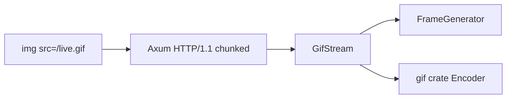

# 02 — Architecture

Design note for the code you will implement after the environment is ready. Keep science in [`EXPERIMENT.md`](../../EXPERIMENT.md); keep run protocols in phases `03`–`07`.

## Goal

Agree on module seams, stack, and HTTP invariants before writing the first streaming response.

## Prerequisites

- [`01-environment.md`](01-environment.md) checklist started (tools available).

## High-level flow



Two **deep** modules; a thin HTTP handler:

| Module | Interface (small) | Implementation (deep) |
|--------|-------------------|------------------------|
| `GifStream` | Writer + interval + trailer policy | Header, loop, flush, trailer |
| `FrameGenerator` | Frame index → palette-index buffer | 64×64 synthetic scene |
| Axum handler | Mount routes, set headers, body stream | Almost no GIF logic |

## Planned layout

```
src/
  main.rs          # app, routes, static index
  gif_stream.rs    # GifStream: header + frame loop + trailer policy
  frames.rs        # FrameGenerator: synthetic 64×64 frames
static/
  index.html       # 
```

## Interfaces

### `GifStream`

Owns the open GIF byte stream.

Inputs:

- a byte writer (response body / async sink)
- frame interval (e.g. 1 s)
- trailer policy:
  - `Never` — open stream (phase 2+)
  - `AfterN(n)` — finite GIF (phase 1)
  - `OnDrop` — trailer when the connection ends, if useful later

Behaviour:

1. Write GIF89a header, logical screen descriptor, global color table, optional loop extension.
2. For each frame: ask `FrameGenerator`, encode one complete frame, **flush**.
3. Apply trailer policy; keep the connection open when policy is `Never`.

### `FrameGenerator`

- Input: frame index `n` (and later, elapsed time if needed).
- Output: full-frame buffer of palette indices (no LZW here).
- v1 scene: small resolution (e.g. 64×64), black background, moving white block, 2–4 colours, global palette, no transparency, no delta encoding.

## Stack (v1)

Pragmatic path from [`EXPERIMENT.md`](../../EXPERIMENT.md):

- `tokio`
- `axum`
- crate `gif` for LZW / frame encoding

Fall back to manual binary emission only if the crate forces a finite file, refuses an open encoder, or buffers the whole GIF before flush.

## HTTP invariants

Every `/live.gif` response should:

| Invariant | Value / rule |
|-----------|----------------|
| `Content-Type` | `image/gif` |
| `Cache-Control` | `no-store` (avoid stale partial GIFs) |
| Body | Streaming / chunked |
| `Content-Length` | Absent for open streams |
| Flush | After each complete frame |
| Trailer `0x3B` | Only when trailer policy says so |

## Out of scope for v1

- Local color tables
- Transparency / disposal tricks beyond what the encoder needs
- Sophisticated delta / dirty-rect encoding
- HTTP/2 as the primary path
- Reverse proxies in front of the app

## Completion checklist

- [x] Layout above accepted (or deviations noted below)
- [x] Trailer policy enum agreed (`Never` / `AfterN` / `OnDrop`)
- [x] Stack choice: start with `gif` crate (manual later if blocked)
- [x] HTTP invariants listed above will be applied in the handler / stream

## Deviations

Accepted before coding (2026-09-08):

- **Bind** `127.0.0.1:3000` — ports 8000/8001/8080 already in use on the lab machine; localhost only, no proxy, HTTP/1.1.
- **`gif` crate writes trailer `0x3B` on `Drop` / `into_inner`.** There is no public skip-trailer API. `AfterN` / `OnDrop` rely on that Drop. `Never` wraps the encoder in `ManuallyDrop` (or `mem::forget`) so Drop never runs. Stay on the crate for v1; manual encoder only if this blocks a later phase.
- **Flush means yield an HTTP chunk**, not `Write::flush` on the encoder. After each complete frame, drain a `ChunkWriter` via `Encoder::get_mut()` and yield one body chunk. Hyper sets `Transfer-Encoding: chunked`; do not set `Content-Length` or `Transfer-Encoding` ourselves.
- **`OnDrop` is best-effort.** Client disconnect drops the Axum body; a late trailer may never leave the socket. Keep the variant for phase 5 experiments; do not treat it as reliable yet.
- **Default scaffold mode:** `TrailerPolicy::AfterN(10)`, interval 1 s (GIF graphic-control delay `100` = 1.00 s). Switch later via env (`GIF_TRAILER=never`) rather than a second endpoint.
