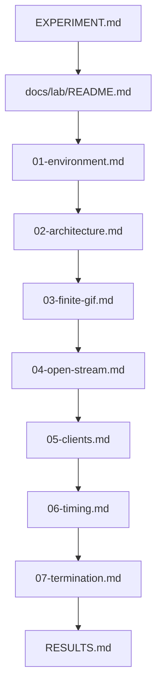

# Lab notes — incremental GIF over HTTP

Operational notes for running the experiment. Science (hypothesis, variables, success criteria) lives in [`EXPERIMENT.md`](../../EXPERIMENT.md). These files tell you what to set up, build, run, and record.

## Question (one line)

Can a browser’s `` decode and animate a GIF while the HTTP response is still open and frames keep arriving?

## Reading order

| Step | File | Role |
|------|------|------|
| Science | [`EXPERIMENT.md`](../../EXPERIMENT.md) | Hypothesis, variables, success/failure criteria |
| Map | This file | Order and what each note decides vs records |
| Setup | [`01-environment.md`](01-environment.md) | Machine, tools, localhost rules |
| Design | [`02-architecture.md`](02-architecture.md) | Module layout and HTTP invariants (decide before coding) |
| Phase 1 | [`03-finite-gif.md`](03-finite-gif.md) | Valid finite GIF — **blocks** later phases if it fails |
| Phase 2 | [`04-open-stream.md`](04-open-stream.md) | Open stream, no trailer |
| Phase 3 | [`05-clients.md`](05-clients.md) | Compare clients |
| Phase 4 | [`06-timing.md`](06-timing.md) | Frame-interval sensitivity |
| Phase 5 | [`07-termination.md`](07-termination.md) | Close without trailer, late trailer, reconnect |
| Synthesis | [`RESULTS.md`](RESULTS.md) | Fill only after phases 1–5 |

## What decides vs what only records

| File | Decides | Records |
|------|---------|---------|
| `01-environment.md` | Tooling and “no proxy” rule | Checklist that the machine is ready |
| `02-architecture.md` | Module seams, stack, HTTP invariants | — (design note; implement later) |
| `03`–`07` | Protocol for that phase only | Observation tables |
| `RESULTS.md` | Whether to pursue a manual encoder | Confirmed/refuted hypothesis, best scenario |

## Gate rules

- Start a phase only after the previous phase’s completion checklist is marked.
- **Phase 1 failure** (invalid or non-animating finite GIF) blocks phases 2–5 — fix the encoder/stream first.
- **Phases 2–5 failure** is a scientific result, not a reason to rewrite the server from scratch. Note it and continue when the protocol says so.

## How to use a phase note

Each of `03`–`07` has the same shape:

1. Objective and prerequisite
2. Protocol (human steps)
3. What not to change (keep variables isolated)
4. Completion checklist
5. Observation table
6. If it fails: science vs debug
